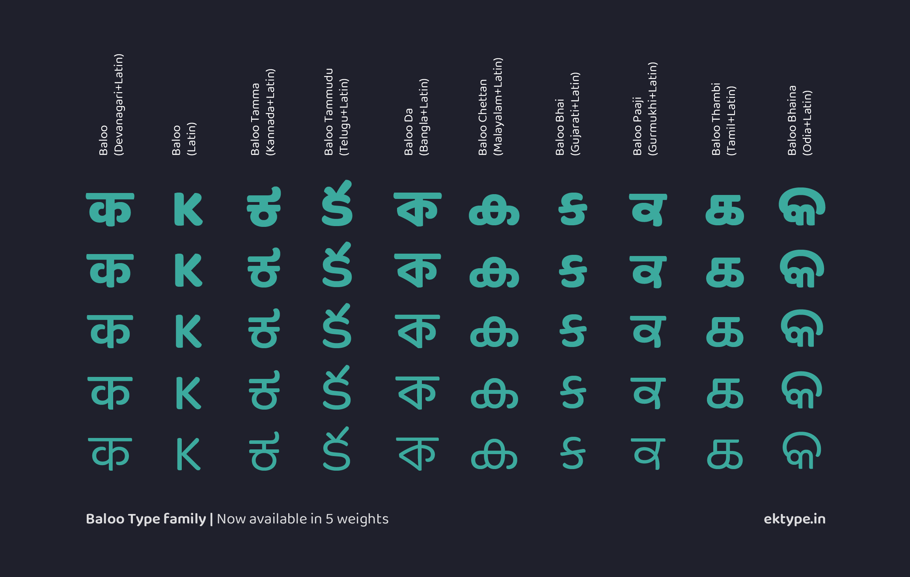

# Baloo 2

A perfect blend of pointy paws in a coat of fur, Baloo is an affable display typeface by Ek Type. This heavy spurless design has already garnered praise for its distinctive jovial nature and its multi script design.

Baloo 2 is an extension of the earlier Baloo project. The new Baloo 2 includes additional glyphs, engineering improvements, and has been extended to FIVE weights, ranging from the light footed Regular to the affable ExtraBold. The lighter weights retain Baloo’s characteristic bounce, but they do so slightly, infusing life into each word. This allows the new family to freely fraternise with texts of all sizes and temperaments — be it short bursts or copious reams, demanding headlines or whispering bylines. Carefree yet confident, sprightly yet versatile, the renewed family of Baloo promises to bring warmth to every project.

The Baloo 2 project consists of nine font families with unique local names for each of the nine Indic scripts. Each family supports one Indic script plus Latin, Latin Extended, and Vietnamese.

- Baloo 2 for Devanagari
- Baloo Bhai 2 for Gujarati
- Baloo Bhaina 2 for Odia
- Baloo Chettan 2 for Malayalam
- Baloo Da 2 for Bengali
- Baloo Paaji 2 for Gurmukhi
- Baloo Tamma 2 for Kannada
- Baloo Tammudu 2 for Telugu
- Baloo Thambi 2 for Tamil

It took a team of committed type designers to rear Baloo and raise it to be the typeface we love. The Gurmukhi is designed by Shuchita Grover; Bangla by Noopur Datye and Sulekha Rajkumar; Odia by Yesha Goshar, Manish Minz, and Shuchita Grover; Gujarati by Noopur Datye and Supriya Tembe; Kannada by Divya Kowshik and Shuchita Grover; Telugu by Maithili Shingre and Omkar Shende; Malayalam by Maithili Shingre and Unnati Kotecha; and Tamil by Aadarsh Rajan. Baloo Devanagari and Latin are collaboratively designed by Ek Type. Font engineering and type design assistance by Girish Dalvi.

### License

Baloo 2 is licensed under the SIL Open Font License v1.1 (<http://scripts.sil.org/OFL>). 
To view the copyright and specific terms and conditions please refer to [OFL.txt](https://github.com/EkType/Baloo2/blob/master/OFL.txt)

### Downloading font binaries (TTF files)

Find binary releases on <https://github.com/EkType/Baloo2/releases>

### How do I install the font on my computer?

First download the font binaries (TTF files) from the [Github Releases page](https://github.com/EkType/Baloo2/releases), then follow these instructions:

- [Windows](http://windows.microsoft.com/en-us/windows-vista/install-or-uninstall-fonts)
- [GNU/Linux](http://lmgtfy.com/?q=how+to+install+fonts+in+linux)
- [Mac OS X](http://support.apple.com/kb/HT2509)

### Getting Involved

Would you like to contribute to the development of this font? Here is how **you** can help:

1. Tell us about any bugs you find, or enhancements you would like to see

2. Contribute directly to the fonts. In this repository we provide the complete set of source files that we use ourselves to develop the fonts. If you with to contribute directly, please see below how we build the fonts and follow our build process so that we can easily include your contribution, and follow the Github pull request process to send your contribution. 

### Bug Reports

Send us bug reports, feature enhancements or glyph requests, using the [Github Issue Tracker](https://github.com/EkType/Baloo2/issues/). 

